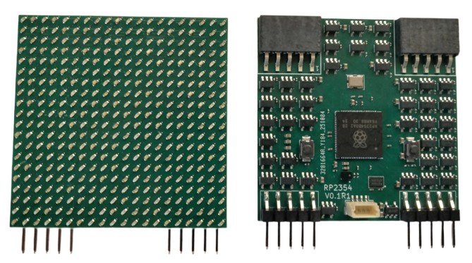

1. TOC
{:toc}

# G6 Panels

The Generation 6 panel is the repeated LED tile used to build a G6 modular display. In the KiCad title blocks, this design is named **`G6 panel 45mm RP2354`**. In the repository, the current panel hardware is organized as the `panel_rp2354_20x20_*` design family.

For a builder, the simplest way to think about the panel is:

- one panel is one **20x20 pixel** display tile
- the arena board provides the larger mechanical and electrical backplane
- a standard G6 arena in the MATLAB tools is **2x10 panels**, or **40x200 pixels** total

At the moment, this repository contains panel design files, production packages, and a few reference exports, but not a separate step-by-step panel assembly guide. This page is therefore mainly an orientation page for choosing the right revision and finding the relevant source files.

## What the panel hardware contains

The current panel BOM and schematics show that each panel includes:

- a **20x20 LED array** (**400 LEDs** total)
- **40 `UCC27517`** driver ICs
- **1 `RP2354B_80QFN`** microcontroller
- **1 `APS6404L-3SQR`** memory device
- **1 `AP2112K-3.3`** regulator
- **2 pushbuttons**
- **1 four-pin JST-SH connector**
- **4 one-by-five board connectors**

The KiCad project is split into several schematic sheets:

- `panel_rp2354_20x20.kicad_sch`
- `panel_mcu.kicad_sch`
- `drivers.kicad_sch`
- `panel_led.kicad_sch`
- `panel_header.kicad_sch`
- `panel_usb_power.kicad_sch`

## Which panel revision should you build?

The repository currently contains three editable panel revision folders:

| Folder | Schematic revision | Production folders |
|---|---|---|
| `panel_rp2354_20x20_v0p1/` | `v0.1.3` | `v0p1r1`, `v0p1r2`, `v0p1r3` |
| `panel_rp2354_20x20_v0p2/` | `v0.2.1` | `v0p2r0`, `v0p2r1` |
| `panel_rp2354_20x20_v0p3/` | `v0.3.1` | `v0p3r1` |

There is no separate panel revision-history page nearby, so the most practical recommendation is:

- treat `v0p1` and `v0p2` as archived design history
- start with **`panel_rp2354_20x20_v0p3/production/v0p3r1/`** for a new build
- only use an older production revision if you need to match hardware that already exists in your lab

## Where the source KiCad files live

Each revision folder contains a complete editable KiCad project. For the newest revision, look in:

`panel_rp2354_20x20_v0p3/`

Key files there are:

- `panel_rp2354_20x20.kicad_pro`
- `panel_rp2354_20x20.kicad_sch`
- `panel_rp2354_20x20.kicad_pcb`

The same structure exists for `v0p1` and `v0p2`.

## Where the manufacturing files live

Archived fabrication outputs are stored under each revision's `production/` directory. The newest package currently present is:

`panel_rp2354_20x20_v0p3/production/v0p3r1/G6_panel_45mm_RP2354_v0.3.1.zip`

The production folders also include the usual PCB assembly support files:

- `bom.csv`
- `positions.csv`
- `designators.csv`
- `netlist.ipc`

## Useful reference files

Top-level rendered panel images for documentation:

- `docs/images/g6_rp2354b_20x20_panel_scaled_no_bg.png`
- `docs/images/g6_rp2354b_20x20_panel_scaled.jpg`

Revision-matched reference exports:

- `panel_rp2354_20x20_v0p1/assets/panel_rp2354_20x20-v0p1r3.pdf`
- `panel_rp2354_20x20_v0p1/assets/panel_45mm_RP2354.step`
- `panel_rp2354_20x20_v0p2/assets/panel_rp2354_20x20_v0.2.1.pdf`
- `panel_rp2354_20x20_v0p2/assets/panel_45mm_RP2354_v0.2.1.step`
- `panel_rp2354_20x20_v0p3/assets/panel_rp2354_20x20_v0.3.1.pdf`
- `panel_rp2354_20x20_v0p3/assets/panel_45mm_RP2354_v0.3.1.step`

For most builders, the rendered PNG above, the revision-matched PDF/STEP files, and the newest production package (`v0p3r1`) are the most useful starting points for understanding the current published G6 panel hardware.

## Current scope of the published panel documentation

At present, the repository supports one clear practical reading of the G6 panel hardware:

- the panel is a **20x20** RP2354-based LED tile
- the newest published design family is **`panel_rp2354_20x20_v0p3`**
- the newest archived manufacturing package is **`v0p3r1`**

If you are building new hardware, start there. If you are debugging or comparing older boards, the `v0p1` and `v0p2` folders are still useful as archived design history.
